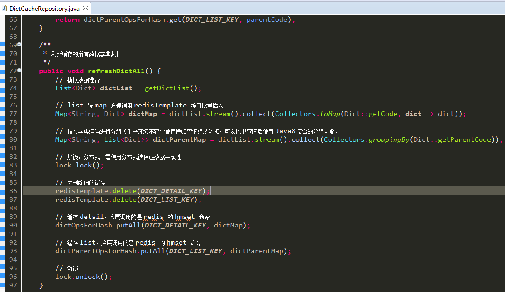
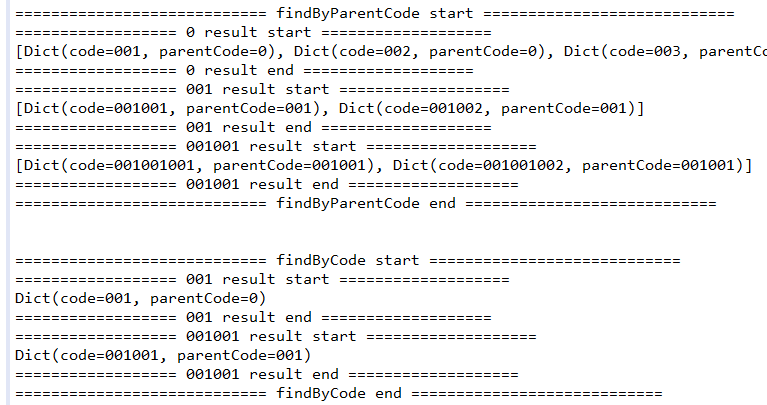

# 使用 Redis 缓存数据字典

## 场景

数据字典一般初始化后，很少会改动。而查询又比较频繁，尤其是作为查询条件时。另外就是列表查询需展示数据字典的中文，而非编码。因此列表查询时需要查中文。

## 方案

可以使用 Redis 缓存查询条件下拉框的数据（根据父编码缓存），以及单独缓存数据字典本身数据，用于列表查询是转换编码为中文，提高查询效率（不需使用数据库连表查询）。

> TIPS：关于列表查询编码转中文的方案，可能读者会使用 Java 的枚举类型解决。但是，若数据字典有改动，则需编程解决，这是非常忌讳的做法。

使用 **Hash** 结构存储，优点如下：

1. 节省内存，Redis 对 Hash 结构存储的数据有优化，且为官方推荐做法
2. 方便操作，如：需缓存多条数据，只需执行 hmset 一条命令即可。若使用 String 类型，还得考虑批操作

## 核心代码

## 运行 DictCacheRepositoryTest 执行测试效果

